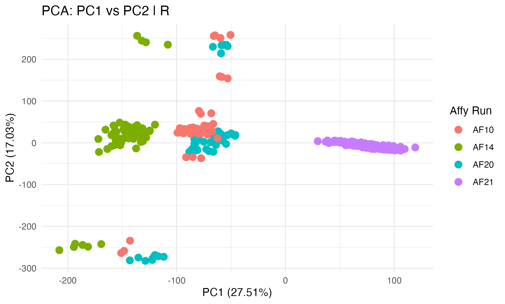
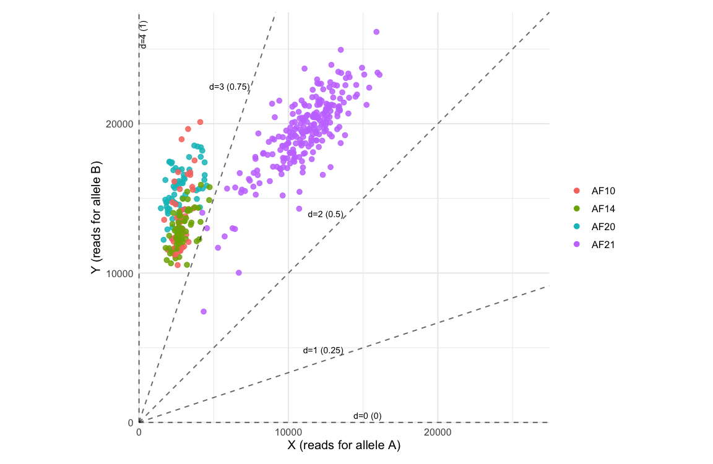

```{r, echo=FALSE}
knitr::opts_chunk$set(
  echo = TRUE,
  message = FALSE,
  warning = FALSE,
  fig.align = "center",
  fig.width = 10,
  fig.height = 10,
  out.width = "40%"
)
```

# Introduction

This tutorial demonstrates a typical workflow for ploidy and aneuploidy estimation using the Qploidy2 R package. 
We will cover data import, standardization, model selection, Hidden Markov Model (HMM)-based copy number estimation, visualization, and VCF export. 

The dataset used here for our demonstration is an alfalfa mapping population genotyped using DArTag technology.
Refer to [this publication](https://doi.org/10.5061/dryad.pc866t1vd) for more information about the dataset.

To start, download the example dataset to your local directory:

```{r}
vcf_path_web <- "https://github.com/Breeding-Insight/BIGapp-PanelHub/raw/refs/heads/long_seq/alfalfa/GenoBrew_example/alfalfa_F1_marker_panel_dataset_publicly_available.vcf.gz"
download.file(vcf_path_web, destfile = "alfalfa_F1_marker_panel_dataset_publicly_available.vcf.gz")
vcf_path_local <- "alfalfa_F1_marker_panel_dataset_publicly_available.vcf.gz"
```

# Remarks

The Qploidy standardization methodology is effective under the following conditions:

* Your marker data originates from Axiom or Illumina genotyping arrays
* Your marker data is derived from targeted sequencing platforms (e.g., DArTag, GTseq, AgriSeq)
* Your marker data is derived from whole-genome sequencing platforms 
* All DNA samples were prepared following the same library preparation protocol (check [this section](#check-for-batch-effect-before-standardization) for more details)
For example: If you extracted DNA and sequenced two plates (192 samples) as one batch, 
and later sequenced an additional three plates (288 samples) as a second batch, you would need 
to analyze the two batches separately in Qploidy. Combining all 480 samples into a single analysis will lead to incorrect results due to batch effects.
* You know the ploidy of at least a subset (rough minimum of 60 samples) or you know the most common ploidy in the dataset.
The higher the number of samples with known or common ploidy, the better the results
* Your dataset includes heterozygous samples

The Qploidy2 B-allele frequency (BAF) model selection and HMM methodologies are effective under the following conditions:

* The ratio or BAF distributions of your samples present clear peaks corresponding to different copy numbers
* The total read depth or z-scores variations within a sample follows a normal distribution, with the mean shifting according to the copy number
* The sample includes heterozygous loci, which are essential for BAF-based ploidy estimation. 
Samples with heterozygosity lower than 5% will be considered haploid (CN = 1) and they cannot be distinguished from inbred lines with higher CN
* If allele counts are based on a sequencing platform, the sequencing should have enough depth to capture dosages of the 
highest possible copy number in the dataset
* The number of markers is sufficient to provide a good resolution for the BAF distributions
* The larger the amount of markers, the smaller the copy number variations that can be detected

# Install

* It requires R version superior to 3.6.0

Install Qploidy2 (if not already installed):

```{r, eval=FALSE}
devtools::install_github("Breeding-Insight/Qploidy2")
```

# Input data

`Qploidy2` receives three main objects named: 
- marker-level data (`data`): should contain sample names, marker ID, allele counts/intensities ratio and total for all samples
- marker positions (`geno.pos`): should contain marker IDs, and respective genomic chromosome and positions
- genotype dosages (`genos`) - only required for standardization: contain samples names, marker ID, 
and dosage/genotype considering expected ploidy. The samples in this file should be the ones with a known ploidy or the full dataset with 
dosage called considering the predominant ploidy. 

`Qploidy2` has functions to facilitate the conversion of standard file formats to these three objects. 
In this tutorial we will show the `qploidy_read_vcf` function for VCF conversion. The VCF must contain the AD field for allele counts.
Check function `?read_axiom` and `?read_illumina_array` if your data comes from genotyping arrays. 


```{r}
library(Qploidy2)

# Read marker-level data from VCF
data <- qploidy_read_vcf(vcf_path_local)
head(data)

# Read genotype dosages (optionally, restrict to samples with known ploidy)
genos <- qploidy_read_vcf(vcf_path_local, geno = TRUE)
head(genos)

# Read marker positions
geno.pos <- qploidy_read_vcf(vcf_path_local, geno.pos = TRUE)
head(geno.pos)
```

# Check data initial status

The `plot_raw` function provides diagnostic plots for metrics that will be considered by `Qploidy2` copy number estimation. 
Here is a brief description of each from top to bottom:

- Heterozygosity: y-axis = proportion of heterozygous loci in a genomic window with size defined by argument `window_size` (default = 2Mb);
x-axis = genomic positions
- Allele counts/intensities ratio (B/(A+B)): y-axis = ratio value; x-axis = genomic positions
- Ratio histogram split by chromosome: y-axis = observation counts; x-axis = ratio value
- Ratio histogram considering all markers of the samples: y-axis = observation counts; x-axis = ratio value
- Read depth (sequencing platforms) or total intensities (array) in y-axis and genomic position in x-axis

```{r}
samples <- unique(data$SampleName)
plot_raw(data = data, 
         geno.pos = geno.pos,
         sample = samples[1])
```

Check the plots for a few samples. If the histograms do not show clear peaks, consider applying `Qploidy` standardization.
If you already have clear peaks and do not want to try to improve them, skip to item [`# BAF Model Selection`](#BAF-Model-Selection).

## Check for batch effect before standardization

Qploidy2 standardization assumes that each marker behaves consistently across samples, while allowing markers to differ from one another. 
Depending on the genotyping platform, however, this assumption may not hold — particularly if DNA extraction protocols were modified or samples were processed in different plates or batches.

For example, you may have extracted DNA at one time point and sequenced a plate with 96 samples in a given year, then used the stored DNA two years later to sequence an additional 96 samples. 
Changes in DNA quality over time can affect probe performance, leading to systematic differences between batches. 
In such cases, standardization should be performed separately for each batch.

You can assess whether batch effects are present in your dataset using the following function:

```{r}
# provide a passport file (containing year of DNA extraction/plate number/ or any possible factor for a batch effect)
# This example dataset doesn't have a passport available, we will simulate one just to exemplify the function usage:
set.seed(123)
samples <- unique(data$SampleName)
passport_file <- data.frame(SampleName = samples, year_seq = sample(rep(c(2020, 2022, 2025), length(samples))))
head(passport_file)
```

```{r}
p <- pca_plot(input = data, 
              geno.pos = geno.pos, 
              passport_file = passport_file, 
              group_column = "year_seq", 
              sampleID_column = "SampleName",
              col2use = "R")

p$PC1xPC2

```

The function draws a PCA using the total depth/intensities values of each marker x sample to identify batch effect between samples.

In this example, we did not detect evidence of batch effects, as samples did not cluster according to genotyping year. 
Therefore, we can proceed with standardization using the combined dataset. 

If your dataset formed clear groups like the figure below referring to another dataset not covered in this tutorial:

{width=30% fig-align="center"}

In this case, perform the standardization separately for each and merge the result using `merge_qploidy_datas` function.

You can also verify the effect of batches considering a single marker and all samples:

```{r}
plot_xy_with_ploidy_guides(data, ploidy = 4, marker = 1, samples = passport_file, palette = "auto")
```

Again, for this dataset, no difference is observed but here are some markers examples from another dataset that has batch effect:

{width=30% fig-align="center"}

{width=30% fig-align="center"}

{width=30% fig-align="center"}

Dosage call methods such as `fitPoly`, `updog`, and `polyRAD` use these type of ratio distributions (one marker and all samples) 
to estimate each dosage cluster. If you have batch effect between your runs (as the figures above), they will also affect the 
quality of dosage call using these software. Therefore, you should conduct dosage/genotype call individually for each batch.

## Initial screening for chromosome abnormalities (optional)

For some genotyping platforms, total read depth is consistent across samples. 
When this assumption holds for your dataset, deviations in a sample’s total depth relative to the population average can provide an initial indication of copy number variation.

You can rapidly screen for candidate samples using the function below:

```{r}
chromosome_level_test_plot_qploidy(input = data, 
                                   geno.pos = geno.pos, 
                                   selected_samples = samples[1:12], # plot the first 12 
                                   col2test = "R")
```

Before proceeding to the standardization step, consider removing abnormal chromosomes from your reference dataset (genos).

## Overview of samples heterozygosity

```{r}
# interactive graphic if plotly package is installed
p <- plot_heterozygosity(data, col2use = "ratio")
p
```

This is an interactive graphic; hover your mouse over the cells to get information on sample name, heterozygosity percentage, and the number of markers used for this estimation.
Heterozygosity is an important metric for Qploidy2, as it uses the allele ratio heterozygous peaks as part of the input data for estimating ploidy. 
**Samples with heterozygosity lower than 5% will be considered haploid (CN = 1) and cannot be distinguished from inbred lines with higher CN.**

# Standardization

Standardization of markers raw read counts or intensity data is essential for reducing technical noise 
and improving the accuracy of ploidy estimation. Markers from diverse platforms have different 
characteristics, and standardization helps to make them comparable. 

The function has several parameters that can be adjusted based on the characteristics of your dataset.
You can access a description of all parameters in `?standardize`. Here we will focus only on two of them:
`ploidy.standardization` and `threshold.n.clusters`:

**Parameters:**
- `genos`: This data.frame defines which samples are your reference for the standardization. If you have samples with known ploidy, filter this object to keep only them. You can use the command:

```{r, eval = FALSE}
# Demonstration code, not applied to current dataset
# known_tetraploids <- paste0("Sample",1:100)
# str(known_tetraploids)
# genos <- genos[which(genos$SampleName %in% known_tetraploids),]
```

If you are not sure about ploidy of at least 60 samples, just keep all them and define the most common ploidy as `ploidy.standardization`.

- `ploidy.standardization`: Sets the predominant ploidy for the dataset defined in the object `genos` (e.g., 2 for diploid, 4 for tetraploid). This guides clustering and normalization, and should match the known or most frequent ploidy in your samples for best results.

- `threshold.n.clusters`: Minimum number of genotype clusters required for a marker to be retained. The maximum is defined as the possible number of the dosages according to the ploidy
defined on `ploidy.standardization` (ploidy + 1). Lower values requires imputation of dosage clusters for missing genotypes. The imputation is performed based on distance to other clusters, 
so it is recommended to have at least 3 clusters for a good imputation. If too many markers are filtered, relax this threshold (e.g., to 4 for tetraploids) to retain more markers with imputed clusters.

```{r}
qploidy_standardization5 <- standardize(
  data = data,
  genos = genos,
  geno.pos = geno.pos,
  ploidy.standardization = 4, # Set to known or most frequent ploidy
  threshold.n.clusters = 5,   # Minimum clusters for marker retention
  n.cores = 2,
  out_filename = "standardization.tsv.gz",
  verbose = TRUE, 
)

# Check filtering summary
qploidy_standardization5
```

The graphics below provides a visual explanation of how the standardization worked for 6 different markers:

```{r}
plot_geno_by_marker(qploidy_standardization5, alpha = 0.1, marker = c(1,19,24,51,56,57))
```

Observe three different situations:

- The second, fourth, fifth and sixth markers: these markers had at least two samples included in the `genos` 
data.frame above (reference samples) for each dosage expected considering the ploidy defined at `ploidy.standardization = 4`.
Therefore, standardization could be performed for all the dosages. It re-position the centroids of ratios dosage clusters (red dots) 
to the expected position (blue dots). After standardization every markers have dosage clusters centroids in same positions, making
possible to combine them for sample, chromosome or chromosome region level BAF distribution evaluation.
- The first marker don't have samples representing three of the dosages (2,3,4) and therefore the marker
was filtered out and will not contain a BAF for downstream analysis (but kept for z-score). 
- The third marker in the figure don't have samples
with dosage 4, missing a single cluster but also discarded given that the defined argument `threshold.n.clusters = 5` requires
at least two samples for all five clusters.

**PS: We use B-allele frequency BAF terminology to refer to standardized ratios.**

If too many markers are filtered due to number of clusters, you relax the cluster threshold:

```{r}
qploidy_standardization <- standardize(
  data = data,
  genos = genos,
  geno.pos = geno.pos,
  ploidy.standardization = 4,
  threshold.n.clusters = 4,
  n.cores = 2,
  out_filename = "standardization.tsv.gz",
  verbose = TRUE
)
qploidy_standardization
```

In this case, Qploidy inputs the position of the missing cluster based on the mean distance between the existing ones making
possible to perform the standardization. In our visual example, the third marker is kept after the change:

```{r}
plot_geno_by_marker(qploidy_standardization, alpha = 0.1, marker = c(1,19,24,51,56,57))
```

The function also generates the Qploidy file `standardization.tsv.gz` that you can reload in another session to recover the
`qploidy_standardization` object:

```{r, eval=FALSE}
qploidy_standardization <- read_qploidy_standardization("standardization.tsv.gz")
```

This file can also be uploaded to `GenoBrew` app for results curation. See section `Interactive curation of results`.

# Quality Assessment and Visualization

Visualize the effect of standardization for each sample and explore BAF and Z-score distributions:

```{r}
plot_qploidy_standardization(x = qploidy_standardization,
                             sample = "J432",
                             type = c("Ratio_hist_overall", "BAF_hist_overall"))

plot_qploidy_standardization(x = qploidy_standardization,
                             sample = "J432",
                             type = c("zscore", "R"))
```

See `?plot_qploidy_standardization` for more plot types.

## Chromosome-level screening for abnormalities based on Z-score (optional)

You can use the same quick check we used before on the raw total depth (R) with the standardized z-scores. This is useful to identify samples with potential aneuploidies or large CNVs before 
running the HMM, and also to select samples with known ploidy to guide the BAF model selection.

```{r}
chromosome_level_test_plot_qploidy(input = qploidy_standardization, 
                                   selected_samples = samples[1:12], 
                                   col2test = "z")
```

# BAF Model Selection

Select the best BAF model for a sample. 
The approach implemented here for this step is based on [`nQuack`](https://github.com/mgaynor1/nQuack)
methods. It tests different statistical distribution mixture models fitting for each tested ploidy on the 
BAF distributions and selects the best based on BIC.
There are two ways of performing it, one "quick and dirt" based on comparing parameters in a grid
and another using `nQuack` EM functions:

- EM approach BAF model selection: has a robust EM algorithm able to return tailored parameters for the selected distribution to users
- Grid approach BAF model selection: does not use an EM algorithm but a grid of parameters to be tested, which is less time- and computationally demanding but may not provide the best parameters for this step

This current tutorial apply the "grid approach". Check tutorial [Qploidy2 and nQuack integration]() for running the EM approach using nQuack and a comparison between the methods results.

This step helps determine the most likely ploidy and mixture 
model parameters for BAF. The selected approach and model will be used in the `Qploidy2` HMM for copy number estimation. 

You can select a sample with known ploidy (e.g., from the previous step) to guide the model selection, 
or test multiple samples and compare results.

## Applying to raw data


```{r}
sample_ratios <- data$ratio[data$SampleName == "J432"]
selected_model_raw <- select_best_baf_model(baf_vec = sample_ratios,
                                            cn_grid= c(2,3,4,5,6),
                                            bw = c(0.02, 0.04,0.1),
                                            plot = TRUE)

selected_model_raw$plot
head(selected_model_raw$grid_results)
```

See that despite selecting as the best a model that inferred the ploidy as 4, the second place inferred as 3 and the likelihood between models don't differ much.
For this dataset, standardization is required for better results. This step and other downstream steps only make this move evident.

## Applying to standardized data

```{r}
selected_model <- select_best_baf_model(qploidy_standardization = qploidy_standardization, 
                                        sample = "J432",
                                        cn_grid= c(2,3,4,5,6),
                                        bw = c(0.02, 0.04,0.1),
                                        plot = TRUE)

selected_model$plot
head(selected_model$grid_results)
```

Using standardized model, the four best models returned ploidy 4 proving to be more stable than without standardization.

# HMM Copy Number Estimation (Single Sample)

Estimate copy number for a sample using a Hidden Markov Model. 
This step provides a robust approach that integrates raw or standardized ratios (BAF) and total depth (Z-score)
information across genomic regions to infer CNV segments. 
Find all parameters description in `?hmm_estimate_CN`.

## Applying to raw data

```{r}
res_raw <- hmm_estimate_CN(data = data, 
                           geno.pos = geno.pos,
                           selected_model = selected_model_raw, 
                           use_values = c("ratio","R"),
                           sample_id = "J432",
                           cn_grid =  c(2,3,4,5,6))

# View results
res_raw
```

Not that the HMM multipoint approach consider the marker position order based on the reference genome used. 
Therefore, changing the reference genome may change the results.

**Warning**: Avoid to use unlikely copy numbers for your specie to decrease the number of tested scenarios.

`Qploidy2` has different ways to visualize the estimated karyotype:

```{r}
plot_karyotype(res_raw, sample_name = "J432", nrow = 2)
```

You can add color by the CN call final likelihood:

```{r}
plot_karyotype(res_raw, sample_name = "J432", nrow = 2, color_by = "post_max_CN")
```

The color show how confident the model was on calling the CN for each of the markers based
on the combination of R/z-score and ratio/BAF.

You can also add color by the BAF weight:

```{r}
plot_karyotype(res_raw, sample_name = "J432", nrow = 2, color_by = "w_baf")
```

This metric shows if the CN for the window was inferred based on the BAF/ratio given the 
presence of heterozygous genotypes within it, or if it was just based on the total depth/z-score
given the lack of heterozygosity. The most confident estimations are the ones that are based on 
both BAF/ratio and R/z-score - they have BAF weight of 0.5 (and 0.5 for z-score weight). 

The function `plot_cn_track` provides a detailed diagnostic of the process:

```{r }
p <- plot_cn_track(hmm_CN = res_raw, data = data, 
                   geno.pos = geno.pos, 
                   sample_id = "J432",
                   show_window_lines = FALSE,
                   z_by_mean = TRUE)

# All panels together
p$arranged
```

Despite not having the same peak resolution as the standardized data, the HMM was robust enough to retun correct result (CN 4) for all chromosomes. 
The standardization will be more critical for more complex scenarios, such as messy ratios, and/or presence of loss or gain of chromosomes. We have some example further in this tutorial.

## Applying to standardized data

```{r}
res <- hmm_estimate_CN(qploidy_standarize_result = qploidy_standardization,
                       sample_id ="J432",
                       cn_grid =  c(2,3,4,5,6))

# View results
res
```

Visualize with the different plots:

```{r }
plot_karyotype(res, sample_name = "J432", nrow = 2, color_by = "w_baf")

p <- plot_cn_track(hmm_CN = res,
                   qploidy_standarize_result = qploidy_standardization,
                   sample_id = "J432",
                   show_window_lines = FALSE,
                   z_by_mean = TRUE)

# All panels together
p$arranged
```

```{r}
# Individual panels
p$baf
p$z
p$cn
p$baf_dist
```

See the results in a `data.frame` format:

```{r}
head(res$by_window)
head(res$by_marker)
head(res$params)
```

# HMM Copy Number Estimation (Multiple Samples)

Run HMM for all samples in parallel. The model will be selected internally using `select_best_baf_model`; you just need to define the grids (`bw`, `add_uniform_grid`, and `uniform_weight_grid`) according to what you observed when running it on a single sample.

**Note**: Running HMM for many samples can be computationally intensive. Adjust `n_cores` based on your resources and dataset size.

## Applying to raw data

```{r}
multi_esti_raw <- hmm_estimate_CN_multi(data = data,
                                        geno.pos = geno.pos,
                                        use_values = c("ratio","R"),
                                        sample_ids = "all",
                                        n_cores = 2, 
                                        cn_grid =  c(2,3,4,5,6),
                                        bw = c(0.02, 0.04,0.1))
```

Visualize summary of CNV for multiple samples:

```{r}
compare_cn_track(hmm_CN = multi_esti_raw,
                 samples_to_plot = samples[1:30],
                 facet_ncol = 8)
```

Again, not the best results for this dataset. Standardization is required.

## Applying to standardized data

```{r}
multi_esti <- hmm_estimate_CN_multi(qploidy_standarize_result = qploidy_standardization,
                                    sample_ids = "all",
                                    n_cores = 2, 
                                    cn_grid =  c(2,3,4,5,6),
                                    bw = c(0.02, 0.04,0.1))
```

Visualize summary of CNV for multiple samples:

```{r}
compare_cn_track(hmm_CN = multi_esti,
                 samples_to_plot = samples[1:30],
                 facet_ncol = 8)
```

Not that sample `85-103` pointed in section 
[`Chromosome-level screening based on z-score`](Qploidy_alfalfa_tutorial.html#71_Chromosome-level_screening_for_abnormalities_based_on_Z-score_(optional)) 
having a higher depth compared to the rest of the 
samples in chromosome 6 suggesting a possible aneuploidy now is presented as four copies. 
The combination of mixed models and hidden markov model eliminated false variations of the expected copy number. 
Applying the approach to the standardized data also eliminated several false CNV identified when running using the raw data. 
See comparison below between raw and standardized data for sample `85-113`.


```{r}
# Plots for a specific sample within the multi-sample object
plot_karyotype(multi_esti_raw, sample_name = "85-113", 
               nrow = 2, color_by = "w_baf")

p_stand <- plot_cn_track(hmm_CN = multi_esti_raw,
                         qploidy_standarize_result = qploidy_standardization,
                         sample_id = "85-113",
                         show_window_lines = TRUE)
p_stand$arranged

plot_karyotype(multi_esti, sample_name = "85-113", 
               nrow = 2, color_by = "w_baf")

p_stand <- plot_cn_track(hmm_CN = multi_esti,
                         data = data,
                         sample_id = "85-113",
                         show_window_lines = TRUE)
p_stand$arranged
```

On the other hand, sample `85-126` highlight a false negative from raw data analysis:

```{r}
# For a specific sample
plot_karyotype(multi_esti_raw, sample_name = "85-126", nrow = 2, color_by = "w_baf")

p_stand <- plot_cn_track(hmm_CN = multi_esti_raw,
                         qploidy_standarize_result = qploidy_standardization,
                         sample_id = "85-126",
                         show_window_lines = TRUE)
p_stand$arranged

plot_karyotype(multi_esti, sample_name = "85-126", nrow = 2, color_by = "w_baf")

p_stand <- plot_cn_track(hmm_CN = multi_esti,
                         data = data,
                         sample_id = "85-126",
                         show_window_lines = TRUE)
p_stand$arranged
```


# Re-standardization (Optional)

If you want to improve BAF resolution (e.g., after identifying a subset of samples with known ploidy via HMM), re-standardize:

```{r}
re_qploidy_standardization <- re_standardize(
  data = data,
  geno.pos = geno.pos,
  hmm_CN_multi  = multi_esti, 
  use_estimated_dosages = TRUE, 
  ploidy.standardization = 4,
  threshold.n.clusters = 4,
  n.cores = 2,
  out_filename = "re_standardization.tsv.gz",
  verbose = TRUE
)

re_qploidy_standardization
```

If argument `use_estimated_dosages` is set to TRUE, Qploidy2 estimates the dosage based on its own algorithm. 
If FALSE, it uses the dosages contained in the initial genos object.

```{r}
# Compare before and after
plot_qploidy_standardization(x = qploidy_standardization,
                             sample = "85-295",
                             type = c("Ratio_hist_overall", "BAF_hist_overall"))
plot_qploidy_standardization(x = re_qploidy_standardization,
                             sample = "85-295",
                             type = c("Ratio_hist_overall", "BAF_hist_overall"))
```

# Re-run the HMM with the new standardization

```{r}
re_multi_esti <- hmm_estimate_CN_multi(
  qploidy_standarize_result = re_qploidy_standardization,
  sample_ids = "all",
  n_cores = 2,
  cn_grid =  c(2,3,4,5,6),
  bw = c(0.02, 0.04,0.1))

# CNV profiles before
compare_cn_track(hmm_CN = multi_esti,
                 samples_to_plot = samples[1:50],
                 facet_ncol = 8)

# CNV profiles after
compare_cn_track(hmm_CN = re_multi_esti,
                 samples_to_plot = samples[1:50],
                 facet_ncol = 8)
```

Among the first 50 samples, sample `85-179` differ between previous standardization and re-standardization results.

```{r}
# Same plots can be generated
plot_karyotype(re_multi_esti, sample_name = "85-182", nrow = 2, color_by = "post_max_CN")

p_re <- plot_cn_track(hmm_CN = re_multi_esti,
                      qploidy_standarize_result = re_qploidy_standardization,
                      sample_id = "85-182",
                      show_window_lines = TRUE)

plot_karyotype(multi_esti, sample_name = "85-182", nrow = 2, color_by = "post_max_CN")

p <- plot_cn_track(hmm_CN = multi_esti,
                   qploidy_standarize_result = qploidy_standardization,
                   sample_id = "85-182",
                   show_window_lines = TRUE)

p$arranged #before
p_re$arranged #after
```

For this dataset, there are a few changes for some samples like the one showed above. 
The predominant yellow color mean that BAF distributions likelihoods were not included in the HMM
due to high dispersion. If this instability still leaves doubts about 
the CNV. You can further explore tweaking the other parameters, 
for example, increasing the number of markers in the windows to better fit the mixed models on the BAF distributions:

```{r}

res_tweak <- hmm_estimate_CN(qploidy_standarize_result = re_qploidy_standardization,
                             sample_id = "85-182",
                             min_snps_per_window = 60,
                             cn_grid =  c(2,3,4,5,6))

plot_karyotype(multi_esti, sample_name = "85-182", nrow = 2, color_by = "post_max_CN")

p <- plot_cn_track(hmm_CN = res_tweak,
                   qploidy_standarize_result = re_qploidy_standardization,
                   sample_id = "85-182",
                   show_window_lines = TRUE)

p$arranged
```

Explore more parameters consulting `?hmm_estimate_CN`.

# Refine results for a single sample

Once you get to a conclusion with results better explain the patterns, you can update your multi-sample
HMM object by using the functions:

```{r}
final_res <- update_hmm_CN_multi(multi_esti, 
                                 res_tweak, 
                                 rm_sample = FALSE)
```

If you decide that the results for this sample is inconclusive, 
you can set the `rm_sample` parameter to `TRUE` to remove it from your final results.

# Plotting all samples in batches (Optional)

Generate CNV plots for all samples in batches:

```{r, eval=FALSE}
n_plots_by_page <- c(seq(1, length(samples), by = 40), length(samples))
for(i in 1:(length(n_plots_by_page) -1)){
  comp_p <- compare_cn_track(hmm_CN = final_res,
                             samples_to_plot = samples[n_plots_by_page[[i]]:n_plots_by_page[i+1]],
                             facet_ncol = 12)
  ggsave(comp_p, filename = paste0("Samples_", n_plots_by_page[i], "_", n_plots_by_page[i +1], ".png"), height = 10, width = 11)
}
```

# Interactive curation of results

## Export HMM results

The resulted objects from function `update_hmm_CN_multi`, 
`hmm_estimate_CN`, and `hmm_estimate_CN_multi` are all classified as 

```{r}
class(res_tweak) # result from hmm_estimate_CN
class(multi_esti) # result from hmm_estimate_CN_multi
class(re_multi_esti) # result from hmm_estimate_CN_multi after re-standardization
class(final_res)  # result from update_hmm_CN_multi
```

Therefore, all of them can be exported by the function:

```{r}
write_hmm_CN(final_res, prefix = "alfalfa_example")
```

You will see three generated files:

- "[prefix]_by_marker.csv.gz"
- "[prefix]_by_window.csv.gz"
- "[prefix]_params.rds"

You can read them back to R using the `read_hmm_CN` function:

```{r, eval=FALSE}
final_res <- read_hmm_CN(by_marker_file = "alfalfa_example_by_marker.csv.gz",
                         by_window_file = "alfalfa_example_by_window.csv.gz",
                         params_file = "alfalfa_example_params.rds")
```

## Deploy `GenoBrew`

The resulted files from `write_hmm_CN` can be uploaded on `GenoBrew` Shiny interface.
The tab `CNV profiles` allow you to interactively inspect the BAF, z-score and CN calls plots,
re-run the HMM adjusting parameters for specific samples and update the results.

Visit `GenoBrew` GitHub [repository](https://github.com/Breeding-Insight/GenoBrew) 
and [tutorial](https://scribehow.com/viewer/GenoBrew_Interactive_Marker_Panel_Evaluation_CNV_Visualization_and_Curation__4uWloBuPT1WlnCvW2UWiTg) 
for more information.

# Call dosages

**Warning**: Beta version - Dosage call requires more testing and review.

Qploidy2 uses the BAF distributions to call dosages. See an example:

```{r}
# res was generated by hmm_estimate_CN above, it contains only one sample 
sample_name <- "85-17"
baf <- final_res$by_marker$baf[final_res$by_marker$SampleName == sample_name]

selected_model <- select_best_baf_model(baf_vec =  baf, 
                                        sample = sample_name,
                                        cn_grid= c(2,3,4),
                                        bw = c(0.02, 0.04,0.1),
                                        plot = TRUE)

dosages_one_sample <- call_BAF_dosages(baf, selected_model = selected_model, plot=TRUE)
head(dosages_one_sample$data)

dosages_one_sample$plot
```

Call dosages for all samples considering the copy number estimated:

```{r}
dosages <- call_hmm_dosages(hmm_CN = final_res)
head(dosages)
```

Once you run the dosage call, you can color the karyotype by the dosage or dosage likelihoods:

```{r}
plot_karyotype(dosages, sample_name = "85-182", nrow = 2, color_by = "dosage")
plot_karyotype(dosages, sample_name = "85-182", nrow = 2, color_by = "post_max_dosage")
```

# Export results

## Summarized by sample, chromossome, window or marker

```{r}
# By chromosome
summ_hmm_chr <- summarize_cn_mode(final_res, level = "chromosome")
head(summ_hmm_chr)

# By sample
summ_hmm_sample <- summarize_cn_mode(final_res, level = "sample")
head(summ_hmm_sample)

# By window
head(final_res$by_window)

# By marker
head(final_res$by_marker)
```

You can use any of your favorite R table export functions to generate a file from those data.frames:

```{r, eval=FALSE}
write.csv(summ_hmm_chr, file = "CN_by_sample.csv")
write.csv(summ_hmm_sample, file = "CN_chromosome.csv")
write.csv(final_res$by_window, file = "CN_by_window.csv")
write.csv(final_res$by_marker, file = "CN_by_marker.csv")
```

## karyotype notation

Function `karyotype_notation` summarises per-marker copy-number calls into a compact karyotype table:
- Ploidy: reports overall ploidy
- ChrID: chromosome ID
- ChrCN: reports most common CN for the chromosome
- Segment: reports position of segment with CN different than estimated overall ploidy 
(ISCN-ispired notation: g.start_end×CN). If not CNV segments were estimated, column reports `NA`

```{r}
k_not <- karyotype_notation(dosages)
head(k_not)

# Example of sample with segmental CN
k_not[which(k_not$SampleName == "85-72"),]
```

## VCF format

```{r}
export_VCF(dosages, file = "alfalfa_Qploidy_CN_dosages.vcf")
```

You can read the VCF with vcfR and extract fields:

```{r}
library(vcfR)
vcf <- read.vcfR("alfalfa_Qploidy_CN_dosages.vcf")
vcf@gt[1:5,1:5]

CN <- extract.gt(vcf, "CN")
CN[1:5,1:5]
```

The VCF format dosages are adapted to the CN estimated by Qploidy2. For example, if the CN is 3, the dosages can be 0,1,2,3 and are represented as 0/0/0, 0/0/1, 0/1/1, 1/1/1. 
If the CN is 4, the dosages can be 0,1,2,3,4 and are represented as 0/0/0/0, 0/0/0/1, 0/0/1/1, 0/1/1/1, 1/1/1/1.

```{r}
tri <- which(CN == "3", arr.ind = TRUE)
CN[tri[1:5,1],25:30]

GT <- extract.gt(vcf, "GT")
GT[tri[1:5,1],25:30]
```

The VCF contains the likelihood of each dosage call in the `PMD` field. The PMD is the probability of the most likely dosage call.
```{r}
dosage_prob <- extract.gt(vcf, "PMD")
dosage_prob[1:5,1:5]
dosage_prob[tri[1:5,1],25:30]

```

# How to cite

### Qploidy - Standardization 

Taniguti, C. H., Lau, J., Hochhaus, T., Arias, D. C. L., Hokanson, S. C., Zlesak, D. C., Byrne, D. H.,
Klein, P. E., & Riera-Lizarazu, O. (2025). Exploring chromosomal variations in garden roses: Insights 
from high-density SNP array data and a new tool, Qploidy. The Plant Genome, e70044. 
https://doi.org/10.1002/tpg2.70044

### Qploidy2 - HMM and grid approach BAF model selection

Manuscript in preparation. Please contact the author for more information.

### nQuack - EM approach BAF model selection

Gaynor, M., Landis, J., O'Connor, T., Laport, R., Doyle, J., Soltis, D., Ponciano, J., & Soltis, P. (2024). 
"nQuack: An R package for predicting ploidal level from sequence data using site-based heterozygosity." 
Applications in Plant Sciences, 12(4), e11606. doi:10.1002/aps3.11606

# Acknowledgments

### Qploidy version 1.0.0 

Funded in part by the Robert E. Basye Endowment in Rose Genetics, Dept. of Horticultural Sciences, 
Texas A&M University, and USDA’s National Institute of Food and Agriculture (NIFA), Specialty Crop 
Research Initiative (SCRI) projects: ‘‘Tools for Genomics-Assisted Breeding in Polyploids: Development 
of a Community Resource’’ (Award No. 2020-51181-32156); and ‘‘Developing Sustainable Rose Landscapes via 
Rose Rosette Disease Education, Socioeconomic Assessments, and Breeding RRD-Resistant Roses with Stable 
Black Spot Resistance’’ (Award No. 2022-51181-38330).

### Qploidy versions > 1.0.0 and Qploidy2 

Supported by [Breeding Insight](https://www.breedinginsight.org/).
